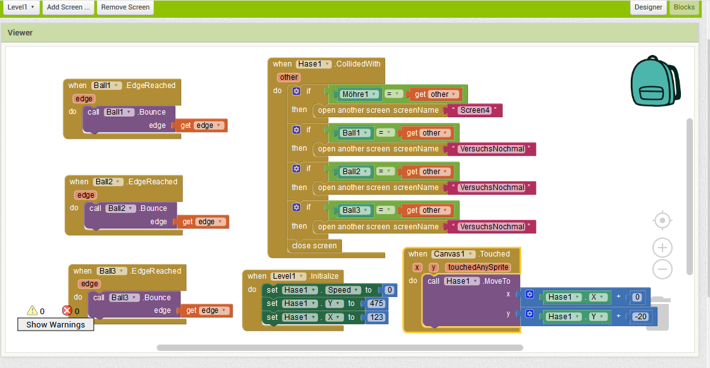
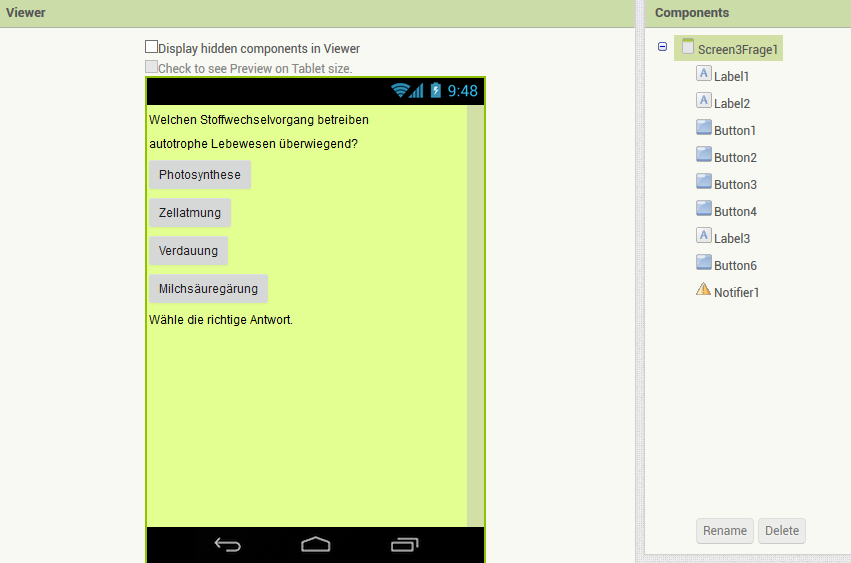
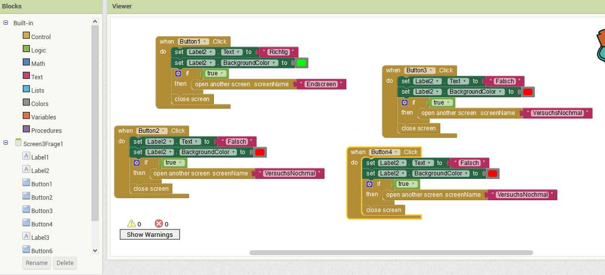
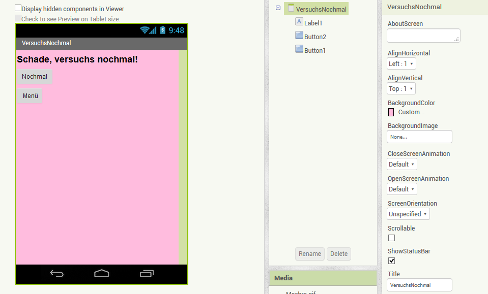
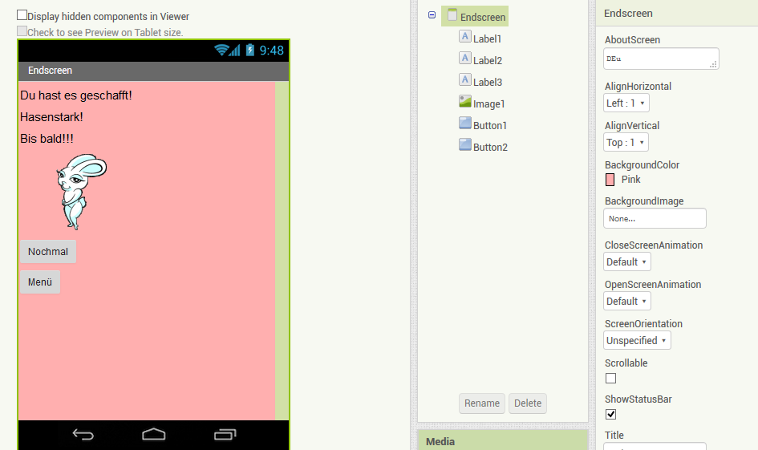

# Rabbio 

von Janina Gräfnitz und Carolin Oelschlägel, Klasse 12a

## Inhaltsverzeichnis
* [Projektvorstellung](#Projektvorstellung)
  * [Die Intention des Spiels](#Intention)
* [Das Spiel selber programmieren](#dssp)
  * [MIT App Inventor](#ai)
  * [Erste Schritte](#ErsteSchritte)
  * [Das Hasen-Spiel programmieren](#DasHasenSpiel)
  * [Die Fragen](#Fragen)
  * [weitere Screens](#weitere)

## Projektvorstellung

Unser Projekt ist ein Spiel namens "Rabbio" und wurde  mit "MIT App Inventor" programmiert.
Das Spiel besteht aus zwei Teilen, einem "Hasen-Spiel"-Teil und einem "Fragen"-Teil.
Insgesamt gibt es drei verschiedene Levels. 
Um ein Level zu bestehen, muss man sowohl den dazugehörigen "Hasen-Spiel"- Teil erfolgreich meistern, sowie die anschließende Frage korrekt beantworten. 
Beide Teile werden mit zunehmendem Level schwieriger.

Das Grundprinzip des Spiels ist es, mit einem Hasen vertikal durch (je nach Level) verschieden schnelle und große Kugeln hindurch zu steuern, um eine Möhre am oberen Bildschirmrand zu erreichen. 
Sobald der Hase die Möhre berührt, erscheint (je nach Level) eine unterschiedlich schwere Frage zum Fachbereich Biologie. 
Nur wenn man die Frage richtig beantwortet, gelangt man zum nächsten Level, bis man letztendlich alle drei Level durchgespielt hat.
Ist das der Fall, gelangt man auf einen Endscreen, auf dem man die Möglichkeit hat das Spiel nochmal zu spielen oder zum Menü zurückzukehren.
Beantwortet man eine Frage falsch oder wird man von einer der Kugeln getroffen, hat man man verloren. 
Man wird dann auf einen Screen weitergeleitet, auf dem man dei Möglichkeit hat nochmal von Level 1 an zu starten oder zurück zum Menü zu kehren. 

Es folgt ein Überblick der verschiedenen Screen-Arten unseres Spiels, welche später noch genauer erläutert werden.

## Die Intention des Spiels 

Mit dem Spiel "Rabbio" sollen der Spaß beim Spielen und das Erweitern des Wissens in dem Fach Biologie miteinender vereint werden. 
Das Spiel soll somit zum Lernen motivieren. Da dieses mit dem Spiel verbunden ist, erscheint es für den Spieler als eine positive Erfahrung. Kognitive, motorische und geistige Fähigkeiten des Spielers werden dadurch miteinander vereint.
Der Name "Rabbio" setzt sich aus den englischen Wörtern "rabbit" und "biology" zusammen. 

## Das Spiel selber programmieren 

### MIT App Inventor 

Um das Spiel selber zu programmieren zu können, sollte man sich zunächst mit dem Programm "MIT App Inventor" vertraut machen.
MIT App Inventor ist ein seit 2010 veröffentliches Programm zum Programmieren in Blocksprache. 
Mit dem Programm kann man Apps für Smartphones und Tablets programmierern, welche mit Android Betriebssystem laufen. Für den Beginn des Jahres 2019 ist geplant, dass die mit MIT App Inventor programmierten Apps auch mit dem Apple Betriebssystem iOS funktionierern.
MIT App Inventor ist online frei zugänglich, vor der ersten Anwendung muss man sich mit seinem Google Konto registrieren.
Danach kann man begonnene Prokjekte online speichern, sodass man jederzeit darauf zugreifen kann und diese weiterbearbeiten kann.
Das Programm funktioniert auf Englisch und 11 weiteren Sprachen, zu denen Deutsch nicht gehört. 

MIT App Inventor teilt sich in zwei Ebenen auf, den Design Editor und den Block Editor. 

In dem Design Editor kann man Hintergründe und ImageSprites erstellen. 
Dazu kann man Bilder von seinem eigenen Computer oder aus dem Internet in das Prokekt hochladen. Besonders an MIT App Inventor ist, dass man mehrere verschiedene Screens designen kann. Dies eignet sich gerade für Spiele wie Rabbio sehr gut, da dieses aus verschiedenen Teilen (dem Hasenspiel und dem Quizteil) besteht, wofür ein komplett verschiedenes Design des Bildschirms nötig ist. 
In die verschiedenen Screens kann man im Design Editor verschiedene Buttons und Labels mit Text hinzufügen.
Desweiteren kann man dort Bälle erstellen, diese kommen auch in unserem Spiel vor. Der wesentliche Unterschied zwischen ImageSprites und Bällen ist der, dass die Bälle sehr simpel aufgebaut sind. An ihnen kann man lediglich die Geschwindigket, Größe u. Ä. ändern. Die ImageSprites können durch Bilddateien individuell gestaltet werden.

In dem Block Editor kann man per Drag and Drop verschiedene Blocks von der linekn Spalte aus den verschiedenen Kategorien auf eine Fläche ziehen. 
Diese kann man beliebig miteinander kombinieren und bei einigen Blocks selber bestimmte Dinge dazutragen. 
Man kann verschiedene Screens miteinander verknüpfen, die Fortbewegung der ImageSprites und die Bälle programmieren und entscheiden, was bei dem Berühren bestimmter anderer ImageSprites oder dem Antippen verschiedener Buttons passiert. 

### Erste Schritte 

Zunächst muss man ein neues Projekt auf MIT App Inventor erstellen.
Man sollte sich bestenfalls bereits vorher ein Konzept gemacht haben, wie das Spiel aufgebaut sein soll.
Dann beginnt man mit dem ersten Screen, dieser wird erstellt. Da man die Screens im Nachhinein nicht umbenennen kann, empfiehlt sich direkt verständliche Namen zu verwenden, die das Arbeiten später erleichtern. 
Screen 1, welcher direkt zu Beginn erstellt wird, ist immer der Startscreen des Spiels, er öffnet sich direkt, wenn man die App auf dem Smartphone startet. 

Deshalb empfiehlt sich für Screen 1 ein Label mit dem Spielnamen zu erstellen (hier: Rabbio oder auch einfacher "Startscreen"), außerdem einen passenden Hintergrund zu wählen (hier: die Spielfarbe grün), eine kurze Spielanleitung einzufügen und gegebenenfalls ein ansprechendes Bild (hier: von der Spielfigur, dem Hasen).
Des Weiteren musss ein Button per Drag and Drop eingefügt werden, der später zum Starten des Spiels dienen soll. 
Dies alles geschieht in der Ebene "Design Editor".

 

Anschließend wechselt man in den "Block Editor" 
Dort werden die entsprechenden Blocks per Drag und Drop eingefügt, sodass sich beim Klicken des Start-Buttons ein neuer Screen öffnet (das erste Level des Hasenspiels). Dies geschieht über die Verknüfung der Befehle 
"when Button 1.Click -> do open another Screen ScreenName "Level1" " .
Tippt der Spieler mit dem Finger auf den Button "Spiel beenden", schließt sich die App durch folgende Befehle:
"when Button 2.Click -> do close application" .

 
 
 

## Das Hasen-Spiel 

Nun kann man durch klicken auf "Add Screen" den Screen für das erste Level erstellen. Bei dem Hasenspiel-Screen muss ebenfalls zunächst der Bildschirm designt werden. 
Wichtig ist, dass man einen sogenannten "Canvas" in den Hintergrund ziehen muss. Er füllt diesen komplett aus, nur auf dem Canvas können sich hinterher Bälle und ImageSprites bewegen. In der rechten Spalte können nun Farbe und Form des Canvas gestaltet werden. Um ein Bild als Hintergrund des Canvas zu haben, muss man ein Bild aus dem Internet oder aus den Dateien des Computers hochladen. Dann kann in der entsprechenden Zeile "BackgroundImage" das Bild gewählt werden.

Danach werden alle Elemente, die beim Spiel auf diesem einen Screen vorhanden sein sollen, auf den Canvas gezogen. In unserem Fall sind das drei Bälle und zwei ImageSprites. Diese lassen sich in der linken Spalte unter "Drawing and Animation" finden. Sobald die Elemente auf dem Canvas bzw. dem Screen vorhanden sind, erscheinen diese gelistet in einer weiteren Spalte, die sich direkt rechts des Screens befindet. Klickt man dort auf zum Beispiel "ImageSprite1", kann man nun wieder in der Spalte ganz rechts die Einstellungen für dieses Element tätigen. Beim Erstellen der Möhre sucht man zuerst das Bild aus, dann die Größe und richtet dann die Position der Möhre aus, wo sie sich auf dem Screen befinden soll. Dazu kann man sie entweder zum gewünschten Ort hinziehen oder manuell die x-, y- und z-Werte dafür in der rechten Spalte eingeben. Nun kann man das gleiche mit dem zweiten ImageSprite machen und die drei Bälle programmieren: 

Der Block "When Level1 initialize" gibt an, was passieren soll, wenn dieser Screen gestartet wird. Durch die darunter hinzugefügten Blocks bekommt der Hase eine Startgeschwindigkeit und eine Startposition. 

Wird der Bildschirm (Canvas, siehe Block rechts unten) berührt, bekommt der Hase den Befehl, seine y-Position um 20 Einheiten vertikal nach oben zu verändern. Damit ist der Spieler also in der Lage, den Hasen durch die Kugeln zu steuern. Wenn der Hase mit der Möhre kollidiert (s. Block oben rechts), wird die App einen neuen Screen öffnen, auf dem die erste Frage, vom Schwierigkeitsgrad passend zum ersten Level, angezeigt wird. Berührt der Hase allerdings eine der Kugeln, wird der Screen mit dem Namen "VersuchsNochmal" geöffnet, auf dem die gleichen Worte stehen. Dort hat der Spieler dann durch verschiedene Buttons die Möglichkeit, entweder wieder von vorne zu starten oder zum Menü zurückzukehren. Die BLöcke links programmieren das Verhalten der Bälle. Wenn sie den Rand berühren, sollen sie zurückprallen.

Diese Blocks wiederholen sich bei jedem Screen der weiteren Levels, wo der Hase zur Möhre gesteuert werden muss. Nur das Design des Screens, der geöffnet wird, ist anders, da bei jedem Level eine andere Frage gestellt wird.
Die Bälle werden zudem größer und schneller, sodass das Spiel schwieriger wird. Außerdem werden die Fragen schwerer.

## Die Fragen 

Die Fragen sind aus einem Textlabel, der die Frage anzeigt, und vier Buttons aufgebaut, die die Antwortmöglichkeiten darstellen. Wird die richtige Antwort gewählt, ändert sich ein weiteres Label unter den Buttons von "Wähle die richtige Antwort." zu entweder "Richtig" oder "Falsch".

Dies wird durch die blocks "When Button x clicked" und die verschiedenen angehängten blocks (s. Bild unten) gesteuert. Dieser Aufbau wiederholt sich bei jedem Fragen-Screen. Nur sind die blocks an die richtigen und falschen Antwortmöglichkeiten angepasst, zum Beispiel wenn bei Frage 1 die zweite Antwort richtig ist, muss der block "When Button 2 click", "do set Lebel2 text to "Richtig" und "set Label2 BackgroundColor to (rotes Farbenfeld)" heißen.

 

## Weitere Screens 

Außerdem müssen Screen erstellt werden, die das Spiel etwas abrunden. In diesem Fall gibt es den folgenden Screen für den Fall, wenn man beim Spielen die Bälle berührt oder wenn man die Frage falsch beantwortet. Er ist aus einem textlabel und zwei buttons aufgebaut, mit denen man entweder zum Menü (Screen1) oder von Level 1 wieder anfangen kann. Die Programmierung mit den blocks ist ähnlich wie bei den Fragen. Sie geben den Befehl "Wenn auf Button x geklickt wird, öffne einen neuen Screen namens ..." wieder. 

 

Wenn man das Spiel gewonnen hat, erscheint dieser Screen. Er wird ähnlich programmiert und enthält die gleichen Möglichkeiten des Fortfahrens:

 

